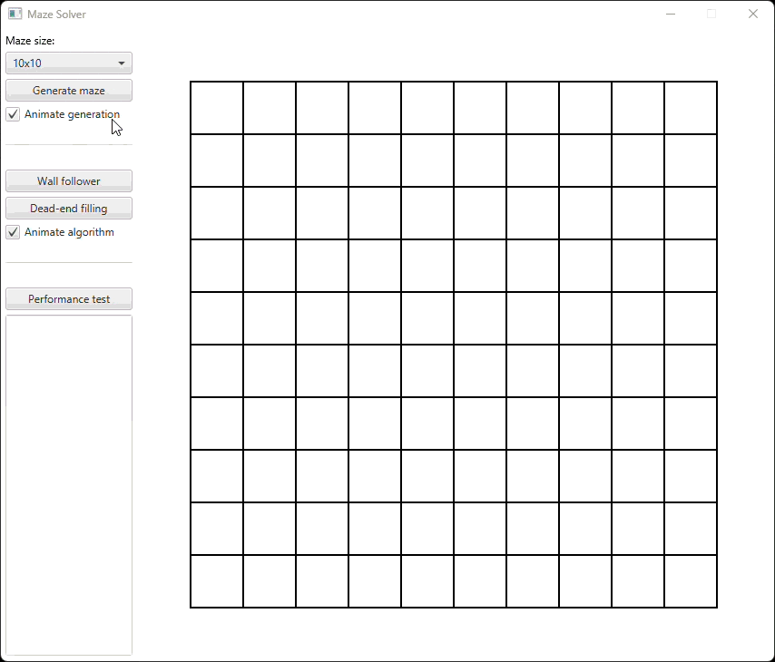

# Maze Solver - Data Structures & Algorithms Project

## Overview

A Java application for generating and solving mazes using classic pathfinding algorithms. Developed as part of the University of Helsinki data structures and algorithms project course.

A runnable .jar file can be downloaded from the [releases](https://github.com/jarkmaen/maze-solver/releases/tag/v1.0.0) page.



## Documentation

[Architecture](documentation/architecture.md)

[Requirements specification](documentation/requirements-specification.md)

[Testing](documentation/testing.md)

[User guide](documentation/user-guide.md)

## Command line operations

To run the commands below, you'll need to have both [Java Development Kit (JDK)](https://www.oracle.com/java/) and [Maven](https://maven.apache.org/) installed on your computer. Run all commands from the root directory of the project (the folder containing the pom.xml file).

### Running the application

To run the application, use the command:

```
mvn compile exec:java
```

### Building the .jar file

To create an executable .jar file, use the command:

```
mvn package
```

This will generate the file mazesolver-1.0-SNAPSHOT.jar in the target/ directory.

### Testing

To run unit tests, use the command:

```
mvn test
```

To generate a test coverage report, use the command:

```
mvn jacoco:report
```

The report's output can be found in the target/site/jacoco/ directory under the name index.html.

### JavaDoc

To generate the JavaDoc documentation, use the command:

```
mvn javadoc:javadoc
```

The report's output can be found in the target/reports/apidocs/ directory under the name index.html.

### Checkstyle

To perform the Checkstyle check, use the command:

```
mvn jxr:jxr checkstyle:checkstyle
```

The report's output can be found in the target/site/ directory under the name checkstyle.html.