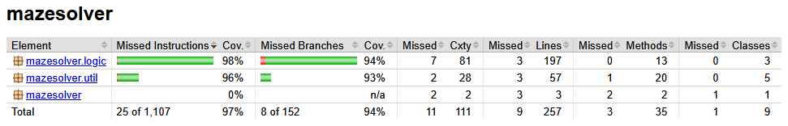

# Testing

The application was tested both manually and with JUnit tests during development. The performance of the maze solving algorithms was also benchmarked.

## Unit testing

### Application logic

The tests in the logic package cover maze generation and both the wall follower and dead-end filling algorithms. The main focus was to verify that the algorithms always produce a correct solution.

### Util classes

Given that all standard Java utility classes were built from scratch, it was important to ensure their functionality. The utility classes ArrayList, Pair and RandomNumberGenerator were tested for their correct functionality.

### Test coverage

The test coverage was measured using JaCoCo. The coverage for the application is 97% for lines and 94% for branches. The UI code as well as the performance test code were excluded from the coverage report.

## Performance testing

Performance testing was performed to measure the runtime of the maze solving algorithms on mazes of increasing size. Mazes were generated before running the algorithms to ensure that only the solving time was measured. The results below show the execution times for both the wall follower and dead-end filling algorithms:

| Maze size        | Wall follower | Dead-end filling |
| ---------------- | :-----------: | :--------------: |
| 100x100          | 7ms           | 3ms              |
| 250x250          | 7ms           | 9ms              |
| 500x500          | 9ms           | 19ms             |
| 750x750          | 121ms         | 49ms             |
| 1000x1000        | 76ms          | 72ms             |
| 2500x2500        | 403ms         | 494ms            |

Notably, the wall follower algorithm was faster in a 1000x1000 maze than in a 750x750 maze, which suggests its execution time can vary depending on the maze structure and the path taken. The dead-end filling algorithm on the other hand shows a more consistent linear increase in execution time as maze size grows.