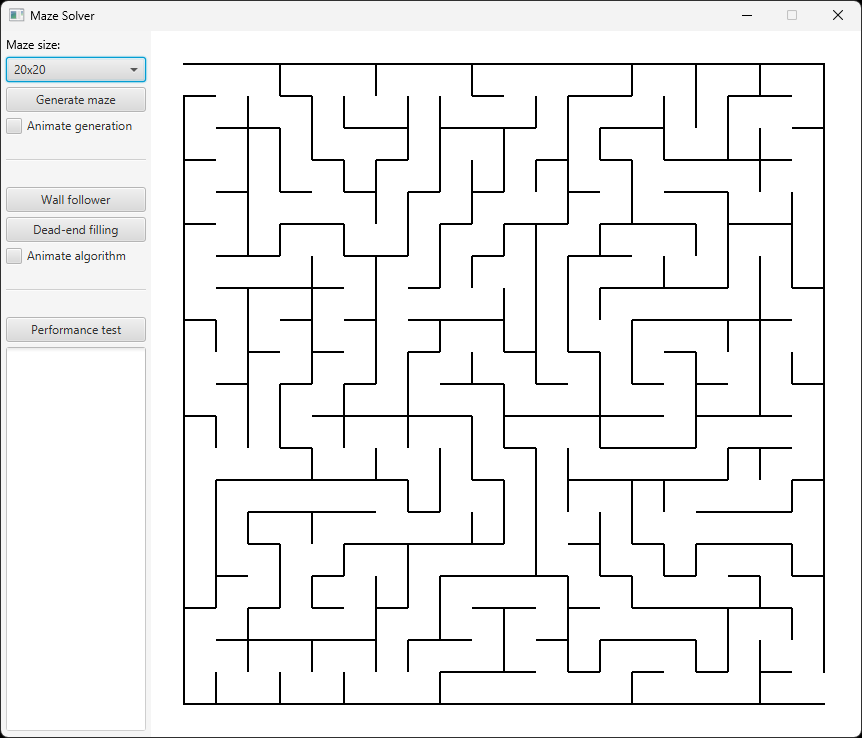

# User guide

## Getting started

To run the application, you'll need to have [Java](https://www.java.com/) installed on your computer. You can then download the latest .jar file from the [releases](https://github.com/jarkmaen/maze-solver/releases/tag/v1.0.0) page and run it directly.

Alternatively, if you want to run the application from the source code, refer to the [Command line operations](../README.md#command-line-operations) section of the README.

## User interface

The user interface is divided into two sections. On the left, a control panel is used to operate the application. On the right, the generated mazes and their solution paths are displayed.

### Control panel

The control panel is organized into three sections:

- The first section lets you choose the size of the maze from a drop-down menu (ranging from 5x5 up to 100x100) and generate it by pressing the "Generate maze" button. You can also enable the "Animate generation" option to watch the maze being built step by step.
- The second section provides the algorithms for solving the maze. The two available options are "Wall follower" and "Dead-end filling". With the "Animate algorithm" option you can visualize the solving process instead of showing the solution instantly.
- The third section allows you to run a performance test. By pressing the "Performance test" button, a benchmark is executed to measure how long the algorithms take to solve mazes of different sizes. The results are printed in the text area below the button.